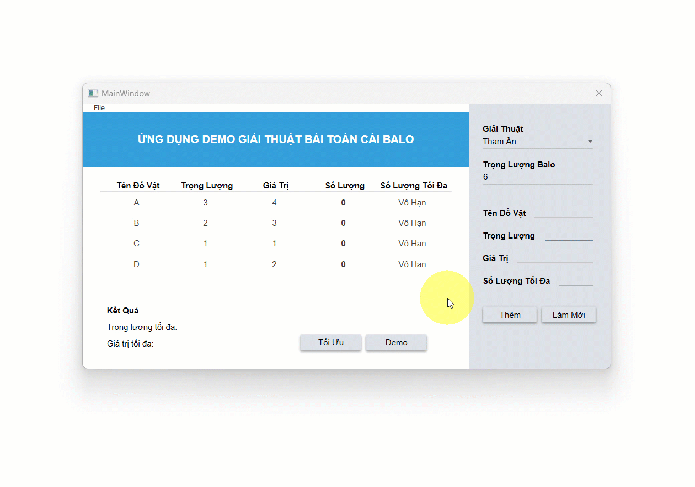

# MÔ TẢ CHỨC NĂNG
## 1. Trực quan hóa giải thuật tham ăn

## 2. Trực quan hóa giải thuật quy hoạch động

## 3. Trực quan hóa giải thuật nhánh cận

## 4. Lưu và mở file 

# CÔNG NGHỆ SỬ DỤNG
 - .NET (WPF)